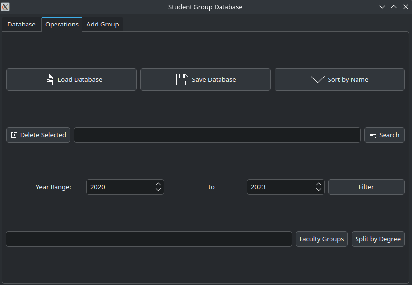

<h1 align="center">Student Database</h1>
<h4 align="center">This is a simple program for operating with a students database.</h4>

There are 2 versions.
The first one is a console-dialog program, where user inputs a number to choose options:

The other one has GUI made with Qt:

